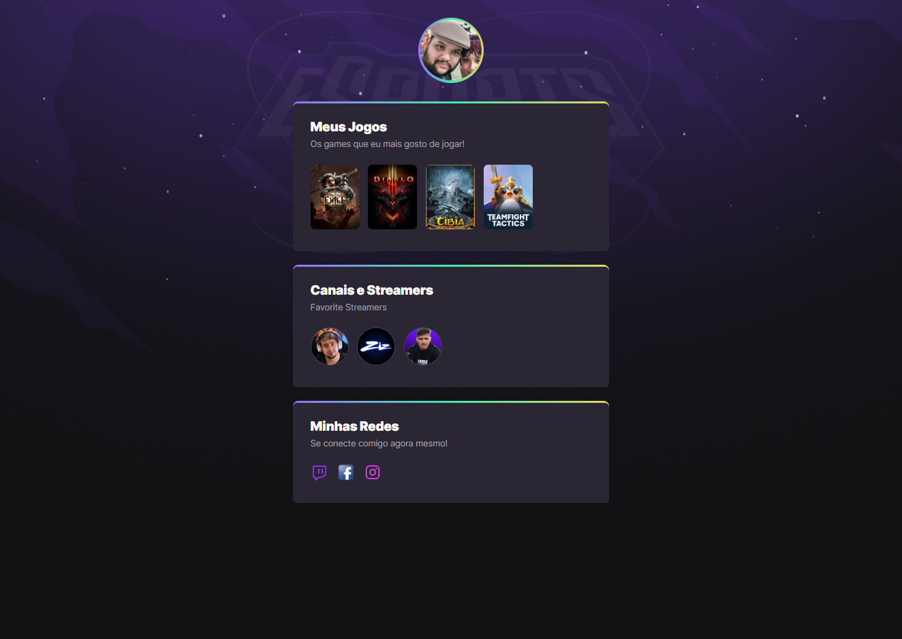

# NLW eSports

> Trilha Explorer

Projeto construído no evento Next Leval week da Rocketseat.

[Clique aqui para acessar](https://mattdiniz.github.io/nlw-esports-explorer)

## Tecnologias

- HTML
- CSS
- Git e Github

## O que aprendi..

- Como iniciar do zero uma pagina web aplicando conceitos da programação html e css.

- Como adicionar links, imagens, animações e transições nos elementos contidos no projeto.

## Motivo do Projeto

- Estou buscando mudar minha vida profissional, focando em migrar para uma área mais tecnológica a qual vejo hoje como o futuro de tudo, área com a qual flertei grande parte da minha vida, mas até hoje sempre me mantive no mercado de trabalho tradicional em empresas locais e trabalhos mais manuais, e no ano de 2022, resolvi mudar de foco, de vida, maneiras de pensar, e acabei por escolher dedicar parte do meu tempo nessa mudança profissional completa buscando conhecimento e crescimento profissional para construir uma carreira nesse mundo tão incrível.

## Contato

mattdiniz777@gmail.com